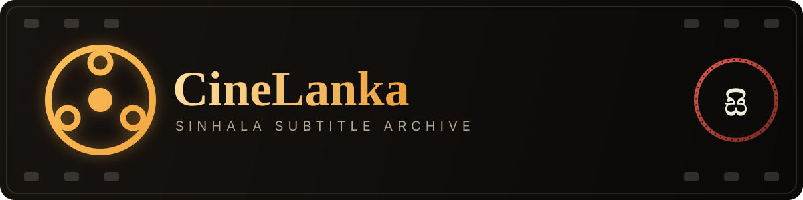
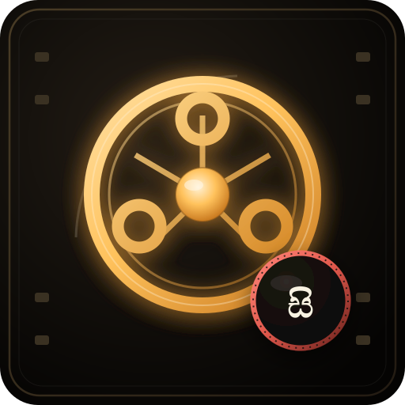
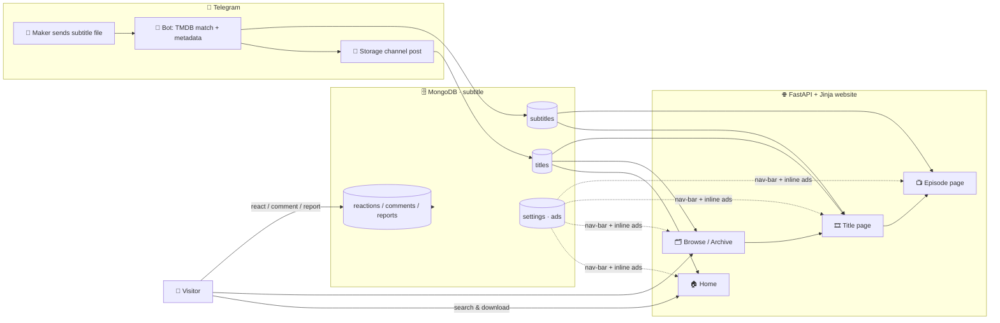
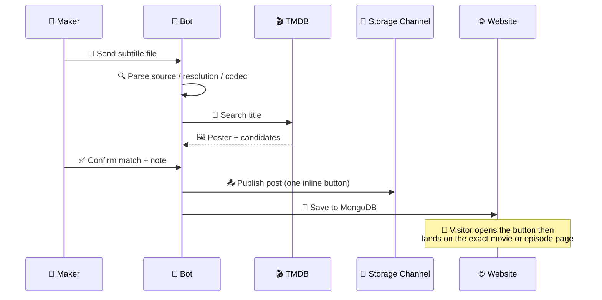

<div align="center">



<br/>



**A release-matched Sinhala subtitle library, run entirely through Telegram.** 🇱🇰

Server-rendered Jinja website · FastAPI backend · MongoDB storage · Telegram-first admin bot

[](https://www.python.org/)
[](https://fastapi.tiangolo.com/)
[](https://www.mongodb.com/)
[](https://www.docker.com/)
[](https://telegram.org/)
[](https://www.themoviedb.org/)


</div>

---

## 📚 Table of contents

- [✨ What is this?](#-what-is-this)
- [🗺️ Architecture map](#️-architecture-map)
- [🌐 Website pages](#-website-pages)
- [🤖 Telegram bot commands](#-telegram-bot-commands)
- [📣 Ad placements](#-ad-placements)
- [🔁 Publishing flow](#-publishing-flow)
- [⚙️ Configuration](#️-configuration)
- [🚀 Deploy on Hugging Face](#-deploy-on-hugging-face)
- [📁 Project structure](#-project-structure)
- [🧬 Telegram transport layer](#-telegram-transport-layer)

---

## ✨ What is this?

CineLanka is a **Sinhala-subtitle library** with two halves that share one MongoDB database:

| Half | What it does | Who touches it |
|---|---|---|
| 🖥️ **Public website** | Fully server-rendered Jinja + FastAPI pages — browse, search, download, comment, react | Visitors |
| 🤖 **Telegram bot** | Upload, TMDB-match, publish, moderate, manage members and ads | Owners / editors / makers |

There is **no public admin panel, login, or upload page** — every management action happens inside Telegram. 🔒

---

## 🗺️ Architecture map



---

## 🌐 Website pages

| Route | Page | Highlights |
|---|---|---|
| `/` | 🏠 Home | Featured title, recently added shelf, movie & series rows |
| `/browse` | 🗂️ Archive | Search, `all` / `movie` / `tv` filters, pagination |
| `/title/{id}` | 🎞️ Title | Poster, backdrop, cast strip (horizontal scroll), 3-line clamped synopsis, episode picker |
| `/title/{id}/s01e02` | 📺 Episode | Episode still, per-episode note, subtitle file list, prev/next pager |

**Page features at a glance:**

- 🎭 **Cast strip** scrolls horizontally with snap-scroll, instead of wrapping into a grid
- ⬇️ Direct-download buttons on every subtitle file row
- 💬 Comments, 👍 👎 reactions, and 🚩 reports via existing API endpoints
- 🈹 Local **Iskoola Pota** font stack for proper Sinhala rendering
- 📐 Full-width layout — no boxed max-width gutters on large screens

---

## 🤖 Telegram bot commands

| Command / button | Role required | What it does |
|---|---|---|
| `/start` | Everyone | Welcome menu, role-based buttons |
| ➕ Submit subtitle | Team member | Upload → TMDB match → publish |
| 🗂 My files | Team member | View / edit / delete your own uploads |
| ✎ My custom name | Team member | Set a display name for channel captions |
| 📚 Team library | Editor / Owner | Browse & manage all published files |
| 🚩 Reports | Editor / Owner | Review and close user reports |
| 👥 Members | Owner | Add / remove team members, set roles |
| 📣 Website ads | Owner | Manage the 5 ad placements below |
| 🔗 Link storage channel | Owner | One-time `AUTH_CHANNEL` peer link |
| `/connectchannel` | Owner | Forward a channel post to link a **private** channel |

---

## 📣 Ad placements

Five independent placements, each toggled and edited straight from **📣 Website ads**:

| Slot key | Label in bot | Where it renders | Style |
|---|---|---|---|
| `site_bar_top` | 🔝 Top nav bar top | Every page, above the site header | 🎞️ Animated scroll strip |
| `site_bar_bottom` | ⬇️ Top nav bar bottom | Every page, fixed directly below the top navigation | 🎞️ Single-copy scroll strip |
| `home_top` | 🏠 Home banner | Homepage, below the stats ledger | 🖼️ Boxed banner |
| `browse_inline` | 🗂️ Browse inline | Archive page, above results | 🖼️ Boxed banner |
| `title_inline` | 🎞️ Title inline | Title & episode pages | 🖼️ Boxed banner |

> 💡 Send `-` to any slot prompt to disable it. Whatever HTML you send is rendered `| safe` — no escaping — so real ad-network embed scripts work as-is.

---

## 🔁 Publishing flow



---

## ⚙️ Configuration

Set these as **Hugging Face Space Secrets** or in a local `config.env`:

| Variable | Purpose |
|---|---|
| `API_ID` / `API_HASH` | 🔑 Telegram app credentials |
| `SITE_NAME` | ✨ Public website and bot display name (default: `CineLanka`) |
| `BOT_TOKEN` | 🤖 Bot token from @BotFather |
| `OWNER_ID` | 👑 Telegram user ID of the owner |
| `AUTH_CHANNEL` | 📢 Storage channel for published posts |
| `PUBLIC_BASE_URL` | 🌐 Public site URL used in the channel button |
| `DATABASE` | 🗄️ MongoDB connection string |
| `TMDB_API` | 🎬 TMDB v3 API key |
| `PORT` | 🔌 Web server port (default `7360`) |

```env
API_ID = ""
API_HASH = ""
SITE_NAME = "CineLanka"
BOT_TOKEN = ""
OWNER_ID = ""
AUTH_CHANNEL = ""
PUBLIC_BASE_URL = "https://your-space.hf.space"
DATABASE = ""
TMDB_API = ""
PORT = "7360"
```

> 🗄️ The app always uses the MongoDB database named **`subtitle`**.

---

## 🚀 Deploy on Hugging Face

1. 🐳 Create a **Docker** Space
2. 📦 Upload this project
3. 🔐 Add the required Secrets from the table above
4. ▶️ Deploy — no Node, Vite, React build, or generated static assets required. PyroFork + TgCrypto install and verify automatically during the Docker build
5. 👮 Make the Telegram bot an **admin** in `AUTH_CHANNEL` so it can post, edit, and delete its own subtitle posts

For a **private** `AUTH_CHANNEL` (`-100...`), after deployment run:

```text
/connectchannel
```

then forward one existing channel post to the bot once. ✅

---

## 📁 Project structure

```text
app/
├── templates/              Jinja HTML pages
│   └── partials/           Shared macros (cards, ad slots, cast strip...)
├── static/
│   ├── css/site.css        Complete UI CSS — theme, ticker, ad bars, cast scroll
│   ├── js/site.js          Comments, reactions, reports, season selector
│   └── brand.svg
├── main.py                 FastAPI routes + Telegram bot logic
├── database.py
├── config.py
├── parsing.py               Source / resolution / codec detection
├── tmdb.py
└── telegram_service.py
docs/
├── banner.svg              README banner
└── logo.svg                README logo (copy of app/static/brand.svg)
Dockerfile
requirements.txt
config.env.example
```

> 🚫 `app/static/site/` is intentionally absent — the site is rendered directly from Jinja templates and static CSS/JS, no build step.

---

## 🧬 Telegram transport layer

The bot runs on **PyroFork** (`pyrofork>=2.3.61`) + **TgCrypto** (`TgCrypto>=1.2.5`) for compiled MTProto acceleration.

> ℹ️ PyroFork intentionally keeps the `pyrogram` Python import namespace for compatibility — that's why `app/telegram_service.py` still does `from pyrogram import Client`. The installed distribution is PyroFork, not the legacy client.

The Docker build verifies PyroFork metadata, the `pyrogram` namespace, and `tgcrypto` before shipping. On a healthy startup you'll see:

```text
PyroFork MTProto enabled (v...) with TgCrypto acceleration (...)
```

No bot token, session, members, channel link, files, website templates, or ad settings need to change for this transport layer.

---

<div align="center">

Made for a fast, release-matched Sinhala subtitle experience 🎬

</div>
